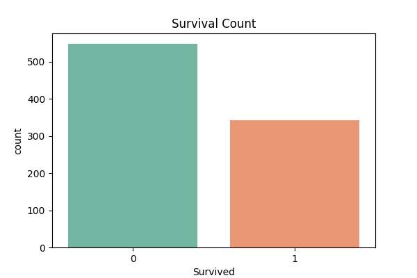
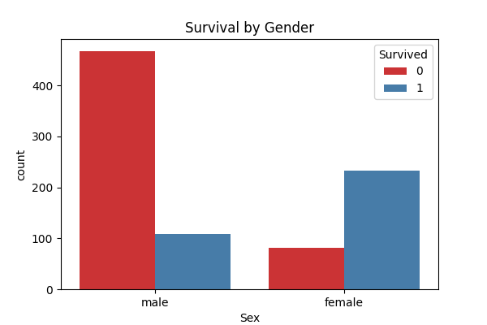
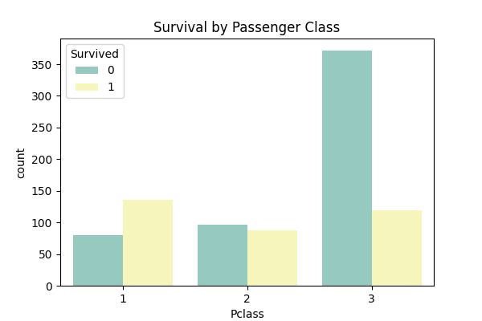
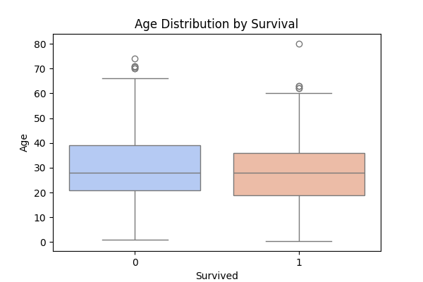
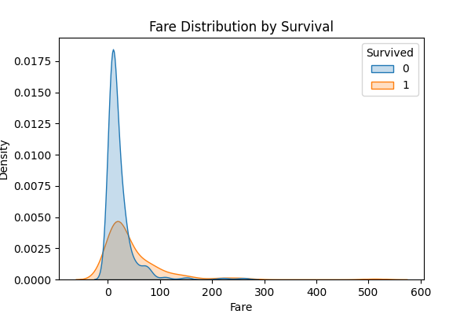

# 🛳 Titanic Dataset Visualization Project

## 📌 Project Overview
This project uses the **Titanic dataset** to explore survival patterns through data visualization.  
We apply **Seaborn** and **Matplotlib** to generate meaningful insights about passengers, survival rates, and demographics.

---

## 📂 Files Included
- `titanic_visualization.py` → Python script to generate visualizations.  
- `train.csv` → Titanic dataset.  
- `images/` → Folder containing saved graphs.  

---

## 📊 Visualizations

### 1. Survival Count
Shows how many passengers survived vs did not survive.  


---

### 2. Survival by Gender
Shows survival rates between **male and female** passengers.  


---

### 3. Survival by Passenger Class
Survival rate compared across **1st, 2nd, and 3rd class** passengers.  


---

### 4. Age Distribution
Distribution of passenger ages on the Titanic.  


---

### 5. Fare Distribution
 


---

## 📈 Insights & Observations
1. **Overall Survival Rate**: More passengers did not survive compared to those who did.  
2. **Gender Impact**: A significantly higher proportion of **women survived** compared to men.  
3. **Class Impact**: **First-class passengers** had a better chance of survival compared to second and third-class passengers.  
4. **Age Distribution**: Most passengers were between **20–40 years old**, but survival was not strictly dependent on age.  
5. **Embarkation Port**: Passengers from **Cherbourg (C)** had a higher survival rate compared to other ports.  

---

## 🚀 How to Run
1. Install dependencies:
   ```bash
   pip3 install pandas seaborn matplotlib
